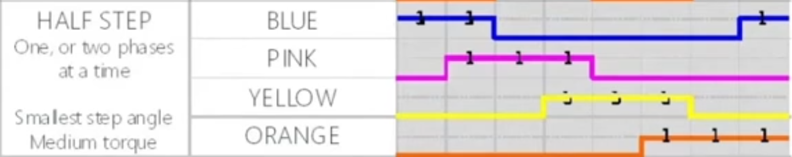
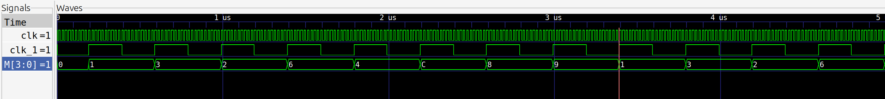
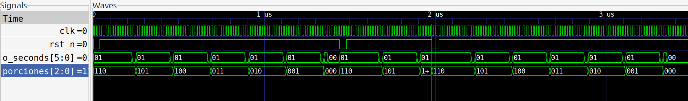

# Nutripet  Proyecto  Digital-I


### Integrantes 

Paulina Jimenez Vargas

Jana Rubiano Hurtado 

Alina Idaly Ortiz Martinez

## Modulos
### div_m (div_m): 
div_m tiene de entrada la frecuencia de la FPGA (50GHz) y tiene como salida una determinada frecuencia para mover el motor, la cual se configura con ```cont```. 1 ciclo del nuevo reloj se calcula como:

$$clk\_1 = 2 \times \frac{cont}{f_{FPGA}} = 2 \times \frac{10⁶}{50 \times 10^6} = 4ms$$

En este caso se configuró cont para que cada ciclo del nuevo reloj se demore 4ms. Esto determina qué tan rápido se mueve el motor.

**NOTA IMPORTANTE:** para correr el test bench se debe bajar el valor de cont para que la simulación corra más rápido. Poner ```cont = 10```

### motor (motor.v):
En el modulo de motor se usa ```div_m``` para obtener ```clk_1``` y así mover el motor a una determinada velocidad. Cada vez que hay un flanco de subida de ```clk_1``` se manda una señale de tensión a las correspondientes bobinas del motor en la secuencia que se muestra en la imagen:

<p align="center">
  
  <br>
  <em>"Secuencia de valores de los bits de M para mover el motor."</em>
</p>

El contador del modulo del motor corresponde a un M, el cual guarda los 8 posibles estados de la secuencia del motor. 
Código obtenido de : https://www.youtube.com/watch?v=wyz6QGYnmfk

**tb_motor**: 
<p align="center">
  
  <br>
  <em>"Simulación en GTKWave para el motor."</em>
</p>

### timer  (temporizador.v)
Código obtenido de: https://www.youtube.com/watch?v=FcbuS9IIWgY&list=PLMonDzz7J8Sk8RD3lap1iBZI3leIPk7wF&index=16


### timer_reg (temporizador_regr.v)
Adaptación de timer para crear un temporizador regresivo que tenga en cuenta un número de porciones y una opción de reset ```rst_n```. El número de porciones determina cuantas veces se reinicia el temporizador. El tiempo del temporizador se debe configurar en ```//Parámetros configurables del contador regresivo```. 

**Incluir flowchart**

**tb_temporizador_regr.**
<p align="center">
  
  <br>
  <em>"Simulación en GTKWave para el temporizador regresivo."</em>
</p>

Donde esta el cursor se hizo un reset antes que terminaran los 6 temporizadores y se puede ver que mientras el reset está presionado el tiempo se detiene hasta que se suelte el reset, las porciones vuelven a 6 y vuelven a correr 6 ciclos del temporizador.

En el test bench se debe configurar la frecuencia como 10. 

### timerMotor (temporizador_regr_motor.v)
En este modulo se instanció el modulo del ```motor```, así, cuando el temporizador llegara a cero el motor se moviera. 

Cada ciclo del temporizador el motor se debe mover 60°, para el modelo 28BYJ-48 (datasheet), por cada pulso de tensión el motor se mueve ```0.087890625°```. El número de ciclos de  ```clk_1``` debe ser:

$$ciclos = \frac{60°}{0.087890625°} 
= 682.6667 \approx 683 $$ 

**Falta perfeccionar algunas cosas del testbench....**


